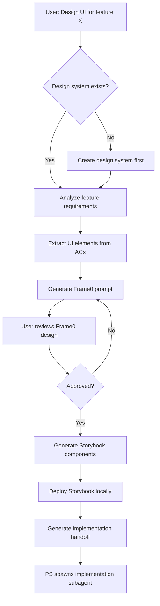
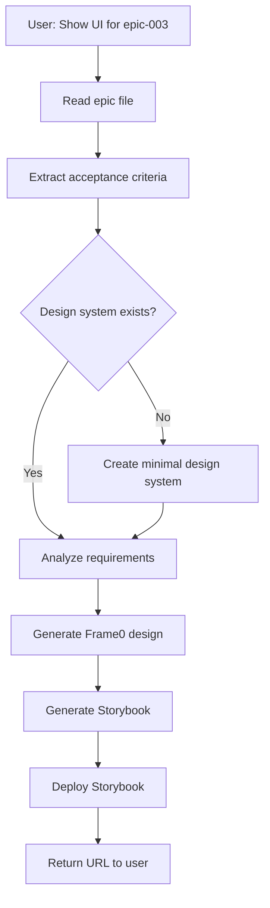
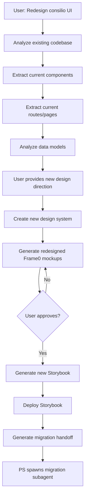

# UI-First Workflow: Flexible Entry Points

**Status**: Planning
**Created**: 2026-01-27
**Epic**: UI-001 (Requirements Analysis Engine)

---

## Overview

This document defines three flexible entry points for the UI-First Workflow, allowing supervisors to invoke UI design capabilities at different stages of the development cycle:

1. **Pre-implementation entry**: Design UI before any code exists
2. **Mid-implementation entry**: Generate UI for epics that are already being implemented
3. **Redesign entry**: Overhaul existing UI with new design system

Each entry point has different context requirements, detection patterns, and handoff formats.

---

## 1. Pre-Implementation Entry Point

### User Intent Patterns

```
"Design UI for [feature name]"
"I want to design the UI first for [feature]"
"Create UI mockups for [feature]"
"Design interface for [epic-XXX]"
"UI-first approach for [feature]"
```

### Context Requirements

**Minimum required**:
- Feature description or epic requirements
- Target project (consilio, odin, etc.)
- Acceptance criteria (if available)

**Optional (enhances design)**:
- Existing design system reference
- Brand guidelines
- Competitor UI examples (URLs or screenshots)
- User personas
- Accessibility requirements

### Workflow Steps



**Detailed steps**:

1. **Design System Check** (`ui_get_design_system`)
   - If none exists, spawn design system creation workflow
   - If exists, load style config and component library

2. **Requirements Analysis** (`ui_analyze_epic`)
   - Parse acceptance criteria
   - Extract UI elements (buttons, forms, tables, etc.)
   - Detect user flows and navigation
   - Identify data requirements
   - Flag accessibility/responsive constraints

3. **Frame0 Design Generation** (`ui_generate_frame0_design`)
   - Build Frame0 prompt from requirements analysis
   - Create initial design in Frame0
   - User reviews and iterates in Frame0 UI
   - Export final design

4. **Storybook Component Generation** (`ui_generate_storybook_components`)
   - Convert Frame0 design to React components
   - Generate component stories
   - Create mock data based on data requirements
   - Include accessibility attributes

5. **Storybook Deployment** (`ui_deploy_storybook`)
   - Allocate port from project range
   - Deploy Storybook instance
   - Create tunnel CNAME (e.g., `consilio-storybook.153.se`)
   - Return public URL

6. **Implementation Handoff**
   - Generate handoff document (see format below)
   - Store in `.bmad/features/{feature}/handoffs/ui-to-implementation.md`
   - PS reads handoff and spawns implementation subagent

### Detection Logic (PS)

```typescript
function detectPreImplementationEntry(userMessage: string): boolean {
  const patterns = [
    /design\s+ui\s+for\s+(.+)/i,
    /ui\s+mockups?\s+for\s+(.+)/i,
    /design\s+interface\s+for\s+(.+)/i,
    /ui-?first\s+(.+)/i,
    /create\s+ui\s+(.+)/i,
  ];

  return patterns.some(pattern => pattern.test(userMessage));
}
```

**Extraction**:
- Feature name from user message
- Check if `.bmad/features/{feature}/` exists
- If not, treat as new feature (spawn BMAD workflow first)
- If yes, proceed with UI design

---

## 2. Mid-Implementation Entry Point

### User Intent Patterns

```
"I want to see the UI for epic-003"
"Generate UI for current epic"
"Show me what the UI looks like for [epic]"
"Create Storybook for epic-XXX"
"Visualize the UI for [feature]"
```

### Context Requirements

**Required**:
- Epic ID (e.g., `epic-003`)
- Epic file path: `.bmad/features/{feature}/epics/epic-{NNN}-*.md`
- Design system (create if missing)

**Derived from epic**:
- Acceptance criteria → UI requirements
- Implementation notes → Component structure
- Data models → Mock data

### Workflow Steps



**Detailed steps**:

1. **Epic Resolution**
   - User provides epic ID: `epic-003`
   - PS resolves to file: `.bmad/features/{feature}/epics/epic-003-*.md`
   - Read epic content

2. **Requirements Extraction**
   - Parse acceptance criteria from epic
   - Extract UI elements, flows, data needs
   - If implementation notes exist, extract component hints

3. **Design System Fallback**
   - If no design system exists, create minimal one
   - Use project defaults (from `.bmad/features/{feature}/design-system-defaults.json` or hardcoded)

4. **Frame0 Generation** (optional)
   - If user wants to iterate, generate Frame0 design
   - Otherwise, skip directly to Storybook

5. **Storybook Generation**
   - Generate components from requirements
   - Use epic data models for mock data
   - Create stories matching user flows

6. **Deployment**
   - Deploy Storybook
   - Return URL
   - User can now see UI before/during implementation

### Detection Logic (PS)

```typescript
function detectMidImplementationEntry(userMessage: string): boolean {
  const patterns = [
    /show\s+ui\s+for\s+epic[- ](\d{3})/i,
    /generate\s+ui\s+for\s+(epic[- ]\d{3}|current\s+epic)/i,
    /visualize\s+ui\s+for\s+(.+)/i,
    /storybook\s+for\s+epic[- ](\d{3})/i,
  ];

  return patterns.some(pattern => pattern.test(userMessage));
}
```

**Extraction**:
- Epic ID from message (e.g., `003`)
- Resolve to epic file
- If no epic found, ask user to clarify

### Use Cases

1. **Parallel development**: Implementation happening, stakeholder wants to see UI
2. **Design review**: Epic ready, need UI preview before implementation
3. **Documentation**: Generate UI screenshots for PRD updates
4. **Testing**: Create UI for manual QA testing

---

## 3. Redesign Entry Point

### User Intent Patterns

```
"Redesign consilio UI"
"Overhaul the UI for [project]"
"New design system for [project]"
"Redesign [specific feature] UI"
"Update UI to match new brand guidelines"
```

### Context Requirements

**Required**:
- Project name (consilio, odin, etc.)
- Scope (entire project or specific feature)

**Optional**:
- New brand guidelines
- Design inspiration (URLs, screenshots)
- Accessibility requirements
- Responsive breakpoints

**Analyzed from existing code**:
- Current components (via code analysis)
- Current routes (via code analysis)
- Current data models (via code analysis)

### Workflow Steps



**Detailed steps**:

1. **Existing Code Analysis** (`ui_analyze_existing_project`)
   - Scan project directory (e.g., `/home/samuel/sv/consilio-s/`)
   - Extract React components (`.tsx` files)
   - Extract routes (from router config)
   - Extract data models (types, schemas)
   - Generate inventory of current UI

2. **User Input**
   - Ask user for design direction:
     - Brand colors, typography
     - Component style (modern, minimal, playful, etc.)
     - Accessibility targets (WCAG AA, AAA)
     - Responsive requirements

3. **New Design System Creation**
   - Create new design system in database
   - Generate style tokens (colors, spacing, typography)
   - Define new component library

4. **Redesigned Mockups**
   - For each existing page/route:
     - Generate Frame0 design with new design system
     - User reviews and approves
   - Export all designs

5. **New Storybook Generation**
   - Generate new components matching designs
   - Create migration stories (old vs new)
   - Deploy new Storybook instance

6. **Migration Handoff**
   - Generate detailed migration plan
   - Map old components → new components
   - Create component migration checklist
   - Store in `.bmad/features/redesign-{project}/handoffs/redesign-migration.md`

### Detection Logic (PS)

```typescript
function detectRedesignEntry(userMessage: string): boolean {
  const patterns = [
    /redesign\s+(.+?)\s+ui/i,
    /overhaul\s+(.+?)\s+(ui|interface)/i,
    /new\s+design\s+system\s+for\s+(.+)/i,
    /update\s+ui\s+(to|for)\s+(.+)/i,
  ];

  return patterns.some(pattern => pattern.test(userMessage));
}
```

**Extraction**:
- Project name or feature scope
- Determine if full project or specific feature
- Check if existing Storybook exists (for comparison)

### Use Cases

1. **Brand refresh**: Company rebrand, update all UI
2. **Accessibility upgrade**: Meet new WCAG standards
3. **Modernization**: Update legacy UI to modern framework
4. **Responsive overhaul**: Add mobile-first design

---

## Entry Point Detection Matrix

| User Message | Entry Point | Primary Tool | Context Required |
|--------------|-------------|--------------|------------------|
| "Design UI for auth flow" | Pre-implementation | `ui_analyze_epic` | Feature description |
| "Show UI for epic-003" | Mid-implementation | `ui_analyze_epic` | Epic ID |
| "Redesign consilio UI" | Redesign | `ui_analyze_existing_project` | Project name |
| "Create UI mockups for login" | Pre-implementation | `ui_generate_frame0_design` | Feature requirements |
| "Visualize current epic" | Mid-implementation | `ui_generate_storybook_components` | Epic file path |
| "New design system for consilio" | Redesign | `ui_create_design_system` | Design preferences |

---

## Handoff Format

### Pre-Implementation Handoff

**File**: `.bmad/features/{feature}/handoffs/ui-to-implementation.md`

```markdown
# UI Implementation Handoff: {Feature Name}

**Generated**: {timestamp}
**Design System**: {design_system_name}
**Storybook URL**: {storybook_url}

---

## Design Overview

{Description of UI design decisions}

---

## Components to Implement

### 1. {ComponentName}

**Location**: `src/components/{ComponentName}.tsx`
**Props**:
- `{propName}`: {type} - {description}

**Acceptance Criteria**:
- [ ] {AC from epic}

**Design Notes**:
{Notes from Frame0 design}

**Mock Data**:
```typescript
{generated mock data}
```

---

## User Flows

### Flow 1: {Flow Name}

**Steps**:
1. {Step description}
2. {Step description}

**Components involved**:
- {Component1}
- {Component2}

---

## Implementation Checklist

- [ ] Install dependencies ({list})
- [ ] Create component files
- [ ] Implement props and types
- [ ] Add accessibility attributes
- [ ] Write unit tests
- [ ] Verify responsive behavior
- [ ] Test user flows
- [ ] Compare with Storybook design

---

## Testing Commands

```bash
# Run Storybook locally
npm run storybook

# Compare implementation with design
open {storybook_url}
```

---

## Next Steps

1. PS spawns implementation subagent with this handoff
2. Subagent implements components matching Storybook
3. Subagent runs validation comparing implementation to design
4. PS verifies Storybook and implementation match
```

### Mid-Implementation Handoff

**File**: `.bmad/features/{feature}/handoffs/epic-{NNN}-ui.md`

```markdown
# UI Visualization: Epic {NNN}

**Generated**: {timestamp}
**Epic**: {epic_file_path}
**Storybook URL**: {storybook_url}

---

## Purpose

This Storybook deployment visualizes the UI for epic-{NNN} based on the acceptance criteria and implementation notes.

**Use cases**:
- Design review before implementation
- Stakeholder preview
- Manual QA testing reference
- Documentation screenshots

---

## Components Generated

{List of components with descriptions}

---

## How to Use

1. **Review design**: Visit {storybook_url}
2. **Iterate**: Provide feedback, regenerate if needed
3. **Implement**: Use as reference during epic implementation
4. **Verify**: Compare implementation with Storybook

---

## Feedback Loop

If changes needed:
1. Update epic acceptance criteria
2. Re-run `ui_analyze_epic` with epic ID
3. Regenerate Storybook
4. Review updated design
```

### Redesign Migration Handoff

**File**: `.bmad/features/redesign-{project}/handoffs/redesign-migration.md`

```markdown
# UI Redesign Migration Plan: {Project}

**Generated**: {timestamp}
**Old Design System**: {old_design_system}
**New Design System**: {new_design_system}
**New Storybook URL**: {storybook_url}

---

## Migration Strategy

{High-level approach: big-bang, incremental, parallel, etc.}

---

## Component Migration Map

| Old Component | New Component | Migration Complexity | Notes |
|---------------|---------------|----------------------|-------|
| `OldButton` | `Button` | Low | Props unchanged |
| `OldForm` | `Form` | Medium | New validation API |
| `OldTable` | `DataTable` | High | Complete rewrite |

---

## Migration Phases

### Phase 1: Design System Setup
- [ ] Install new design tokens
- [ ] Update theme provider
- [ ] Configure Tailwind/CSS-in-JS

### Phase 2: Component Migration (by route)
- [ ] `/login` - {components to migrate}
- [ ] `/dashboard` - {components to migrate}

### Phase 3: Testing & Validation
- [ ] Visual regression tests
- [ ] Accessibility audit
- [ ] Performance benchmarks

---

## Code Changes Required

### Design Tokens

**Old**:
```typescript
const colors = { primary: '#1976d2' }
```

**New**:
```typescript
const colors = { primary: '#3b82f6' }
```

### Component Examples

{Before/after code examples}

---

## Testing Strategy

1. Deploy old and new Storybook side-by-side
2. Visual comparison tool (Percy, Chromatic)
3. User acceptance testing with new design
4. Phased rollout with feature flags

---

## Rollback Plan

{How to revert if issues arise}

---

## Next Steps

1. PS spawns migration subagent with this handoff
2. Subagent implements phase 1 (design system)
3. PS verifies design system working
4. Subagent implements phase 2 (component migration)
5. PS runs validation and testing
```

---

## Integration with BMAD Workflow

### When UI Design Happens in Epic Flow

**Scenario**: User says "Continue building" but wants UI-first for next epic

**Workflow**:
1. PS identifies next epic: `epic-003`
2. PS checks if epic has `.bmad/features/{feature}/epics/epic-003-ui-required` flag
3. If flag exists (or user says "UI first"), PS:
   - Spawns UI workflow (mid-implementation entry)
   - Waits for Storybook deployment
   - Generates UI handoff
   - Spawns implementation subagent with UI handoff
4. Implementation subagent uses Storybook as reference

**Flag mechanism**:
- PSes can add `ui-first: true` to epic frontmatter
- Epic templates include UI preference field
- User can say "Epic 003 needs UI first"

### When BMAD Creates Epics with UI Requirements

**Scenario**: BMAD `plan-feature.md` detects UI-heavy feature

**Workflow**:
1. BMAD analyzes feature request
2. Detects UI keywords: "form", "dashboard", "interface"
3. Sets `ui_required: true` in epic metadata
4. PS reads epic, sees UI required
5. PS automatically spawns UI workflow before implementation
6. Implementation only starts after Storybook deployed

**Detection in BMAD**:
```typescript
function requiresUIDesign(featureDescription: string): boolean {
  const uiKeywords = [
    'form', 'dashboard', 'interface', 'UI', 'design',
    'user interface', 'front-end', 'frontend', 'page',
    'screen', 'view', 'component'
  ];

  return uiKeywords.some(keyword =>
    featureDescription.toLowerCase().includes(keyword)
  );
}
```

---

## Context Requirements Summary

| Entry Point | Required Context | Optional Context | Source |
|-------------|------------------|------------------|--------|
| **Pre-implementation** | Feature description, acceptance criteria, project name | Design system, brand guidelines, examples | User input, epic file |
| **Mid-implementation** | Epic ID, epic file path, project name | Design system | Epic file, `.bmad/features/` |
| **Redesign** | Project name, scope | Brand guidelines, design inspiration | User input, existing codebase |

---

## Open Questions

### 1. User Customization Points

**Question**: How much control does user want over design generation?

**Options**:
- **A. Minimal**: PS generates everything automatically, user only approves/rejects
- **B. Moderate**: User provides design preferences (colors, style), PS generates
- **C. High**: User iterates in Frame0 with PS, manual refinement

**Recommendation**: Start with B (moderate), allow escalation to C if user requests

---

### 2. Storybook Persistence

**Question**: How long do Storybook instances live?

**Options**:
- **A. Ephemeral**: Delete after implementation complete
- **B. Feature-scoped**: Keep until feature deployed to production
- **C. Permanent**: Keep as living documentation

**Recommendation**: B (feature-scoped), with option to promote to C for design system reference

---

### 3. Design System Versioning

**Question**: How do we handle design system changes mid-project?

**Options**:
- **A. Single version**: All features use same design system, breaking changes require migration
- **B. Feature-scoped versions**: Each feature can use different design system version
- **C. Semantic versioning**: Design system has major.minor.patch versions, features declare compatibility

**Recommendation**: C (semantic versioning), with automatic migration scripts for major bumps

---

### 4. Frame0 vs Figma

**Question**: When to use Frame0 vs Figma MCP?

**Options**:
- **A. Frame0 always**: Simpler, integrated workflow
- **B. User choice**: Ask user which tool they prefer
- **C. Complexity-based**: Simple UIs → Frame0, complex UIs → Figma

**Recommendation**: C (complexity-based), with user override option

**Heuristic**:
- Frame0: Forms, simple dashboards, CRUD interfaces
- Figma: Marketing pages, complex interactions, animations

---

### 5. Component Library Conflicts

**Question**: What if generated components conflict with existing project components?

**Options**:
- **A. Overwrite**: Generated components always replace existing (dangerous)
- **B. Namespace**: Generated components use prefix (e.g., `DS_Button` vs `Button`)
- **C. Review**: PS shows diff, user approves merge strategy

**Recommendation**: C (review), with B (namespace) as fallback for auto-mode

---

### 6. Responsive Design Defaults

**Question**: How many breakpoints should we generate by default?

**Options**:
- **A. Mobile-only**: Generate mobile-first, assume responsive CSS handles rest
- **B. Desktop + Mobile**: Two breakpoints (768px split)
- **C. Full spectrum**: Mobile, tablet, desktop (4+ breakpoints)

**Recommendation**: B (desktop + mobile), with C available if user specifies

---

### 7. Accessibility Baseline

**Question**: What's the default accessibility target?

**Options**:
- **A. None**: No accessibility features by default
- **B. WCAG AA**: Reasonable baseline (contrast, keyboard nav, ARIA)
- **C. WCAG AAA**: Strict compliance (higher contrast, extensive ARIA)

**Recommendation**: B (WCAG AA) always, with C available as option

---

### 8. Mock Data Realism

**Question**: How realistic should generated mock data be?

**Options**:
- **A. Minimal**: Simple placeholders ("User 1", "Item 2")
- **B. Realistic**: Faker.js-style realistic data ("John Doe", "john@example.com")
- **C. Domain-specific**: Analyze project domain, generate contextual data

**Recommendation**: B (realistic) by default, with C (domain-specific) if data models available

---

### 9. Storybook Deployment Isolation

**Question**: Should each feature get its own Storybook instance?

**Options**:
- **A. Single instance**: One Storybook per project, all features share
- **B. Feature-scoped**: Each feature gets separate Storybook instance
- **C. Hybrid**: Design system in shared Storybook, features in separate instances

**Recommendation**: B (feature-scoped) for development, A (single) for production documentation

---

### 10. Integration Testing Strategy

**Question**: How do we verify Storybook matches implementation?

**Options**:
- **A. Manual**: Developer compares visually
- **B. Screenshot diff**: Automated visual regression (Percy, Chromatic)
- **C. Component props diff**: Compare Storybook props with implemented component props

**Recommendation**: C (props diff) as baseline, B (screenshot) as optional enhancement

---

## Implementation Priority

**Immediate (Phase 1)**:
1. Entry point detection logic in PS
2. `ui_analyze_epic` tool (mid-implementation entry)
3. Basic Storybook generation and deployment
4. Handoff document templates

**Short-term (Phase 2)**:
5. Frame0 integration (pre-implementation entry)
6. Design system creation workflow
7. Existing code analysis (redesign entry)

**Long-term (Phase 3)**:
8. Visual regression testing
9. Design system versioning
10. Component migration automation

---

## Success Metrics

**User Experience**:
- Time from "I want UI" to "Storybook deployed" < 5 minutes
- User satisfaction with generated designs > 80%
- Iteration count (design → approval) < 3 rounds

**Technical**:
- Generated components match Storybook > 95% (props, styling)
- Accessibility compliance (WCAG AA) = 100%
- Storybook deployment success rate > 98%

**Process**:
- % of features using UI-first workflow
- Reduction in design-implementation mismatch bugs
- Time saved vs manual UI design

---

## Next Steps

1. **User validation**: Review this plan with user, get feedback on open questions
2. **Tool implementation**: Implement entry point detection in PS
3. **MCP tool updates**: Ensure all `ui_*` tools support three entry points
4. **Documentation**: Create user guide for each entry point
5. **Testing**: Test each entry point with real feature examples

---

## Related Documents

- `.bmad/prds/ui-001-requirements-analysis.md` - Requirements analysis PRD
- `.bmad/prds/ui-002-design-system-foundation.md` - Design system PRD
- `src/ui/RequirementsAnalyzer.ts` - Requirements analysis implementation
- `src/ui/DesignSystemManager.ts` - Design system CRUD implementation
- `src/ui/StorybookDeployer.ts` - Storybook deployment implementation
